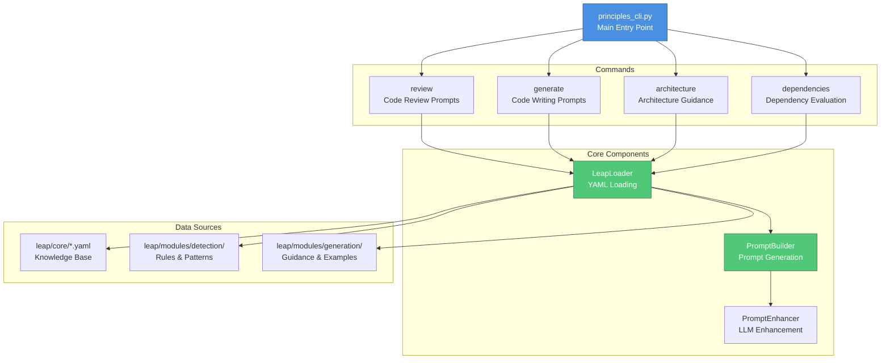
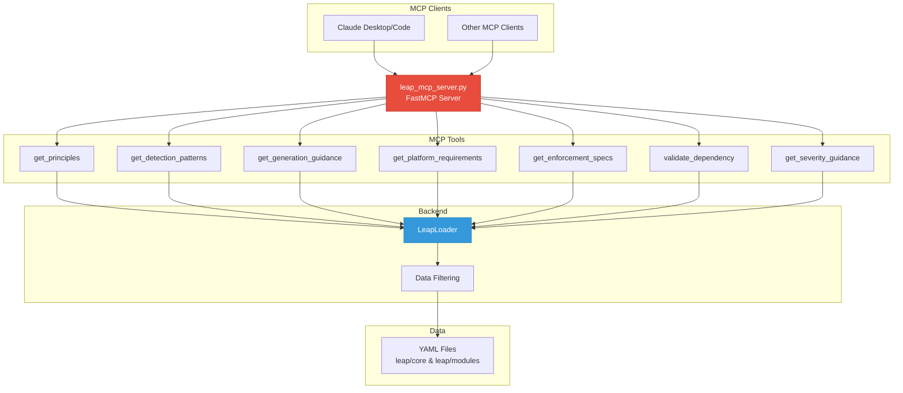
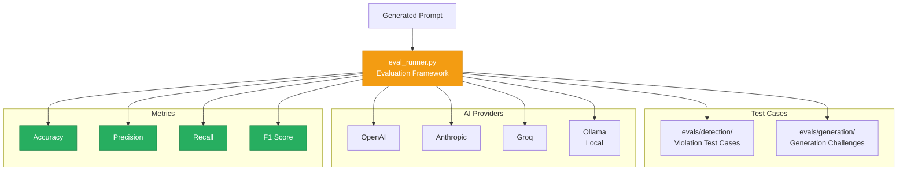
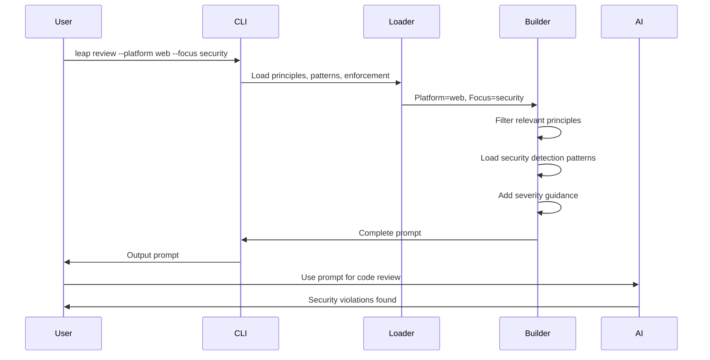
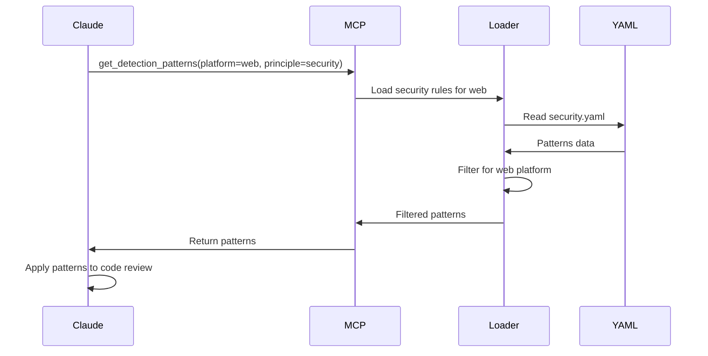

# System Architecture

LEAP uses a modular architecture separating core knowledge from implementation.

## Overview

```text
engineering_principles/
├── leap/                       # Main package
│   ├── core/                   # Shared knowledge base
│   │   ├── philosophy.yaml     # Core values and mantras
│   │   ├── principles.yaml     # All 15 engineering principles
│   │   ├── platforms.yaml      # Platform-specific configurations
│   │   └── enforcement.yaml    # How principles are enforced
│   │
│   ├── modules/
│   │   ├── detection/          # For code review and analysis
│   │   │   ├── rules/          # Detection patterns by principle
│   │   │   ├── severity.yaml   # Issue severity mappings
│   │   │   └── context.yaml    # Context identification rules
│   │   │
│   │   └── generation/         # For code creation
│   │       ├── examples/       # Positive pattern examples
│   │       └── guidance.yaml   # Implementation guidance
│   │
│   ├── loaders.py              # YAML data loading
│   ├── prompt_builder.py       # Prompt generation
│   └── prompt_enhancer.py      # LLM enhancement (experimental)
│
├── evals/                      # Evaluation datasets
│   ├── detection/              # Test cases for detection
│   └── generation/             # Test cases for generation
│
├── tests/                      # Unit tests
├── docs/                       # Documentation
├── principles_cli.py           # Command-line interface
├── eval_runner.py              # Evaluation framework
└── leap_mcp_server.py          # MCP server implementation
```

## Design Philosophy

### Separation of Concerns

**Core Knowledge (What & Why)**
- Immutable beliefs and values
- Engineering principles (the "what")
- Platform configurations
- Rarely changes

**Implementation Modules (How)**
- Detection rules and patterns
- Generation guidance
- Context identification
- Evolves and improves over time

**Evaluation (Validation)**
- Test cases for detection accuracy
- Generation quality checks
- Ensures implementation works

This separation allows:
- Core beliefs to remain stable
- Detection/generation to improve without changing principles
- Independent testing of each component

---

## Core Components

### Knowledge Base (`leap/core/`)

#### `philosophy.yaml`
Engineering culture and values:
- Core mantras (e.g., "We don't defer work")
- Cultural expectations
- Quality philosophy

#### `principles.yaml`
The 15 engineering principles:
- Accessibility
- Code Consistency
- Zero TODOs
- Security
- Unidirectional Data Flow
- Testing
- Flexible Layout
- Continuous Integration
- Code Reviews
- Zero Build Warnings
- Design Integrity
- Localization
- Minimal Dependencies
- Compatibility
- Documentation

Each principle includes:
- Description
- Priority level (Critical → Informational)
- Rationale
- Platform applicability

#### `platforms.yaml`
Platform-specific requirements:

**Android:**
- SDK versions (min 24, target 28)
- Approved dependencies (Dagger, RxJava2, Retrofit)
- Tools (ktlint, detekt, lint)
- Layout requirements
- Security patterns (EncryptedSharedPreferences)

**iOS:**
- Version support (iOS 12+)
- Device support (iPhone SE to XS Max)
- First-party only policy
- Tools (SwiftLint, Slather)
- Security patterns (Keychain)

**Web:**
- Browser support matrix
- Approved dependencies (React, Redux, TypeScript)
- Tools (eslint, stylelint, tsc)
- Accessibility requirements (WCAG 2.1)

#### `enforcement.yaml`
How principles are enforced:
- CI/CD pipeline stages
- Automated checks (linters, tests, security scans)
- Manual review processes
- Severity escalation paths
- Preflight checklists

---

## Detection System (`leap/modules/detection/`)

Two-layer detection architecture:

### Layer 1: Pattern-Based Detection (70-85% Coverage)

**YAML regex patterns** in `rules/`:
- `security.yaml` - Hardcoded secrets, insecure URLs, weak crypto
- `accessibility.yaml` - Missing alt text, ARIA labels, semantic HTML
- `testing.yaml` - Missing tests, flaky patterns, coverage issues
- `architecture.yaml` - Data flow violations, tight coupling

**Severity classification** (`severity.yaml`):
- Critical: Security vulnerabilities, accessibility barriers
- Blocking: Test coverage gaps, build warnings
- Required: Design deviations, missing docs
- Recommended: Code style, best practices
- Informational: Suggestions

**Context identification** (`context.yaml`):
- Platform detection
- Component type classification
- Framework identification

### Layer 2: LLM Enhancement (Experimental)

Optional AI analysis attempts:
- Latest standards (OWASP 2024, WCAG 2.2)
- Framework-specific patterns
- Cross-file dependencies
- Contextual severity adjustment

**Note:** Base YAML patterns provide consistent detection. LLM enhancement is experimental and may introduce false positives.

---

## Generation System (`leap/modules/generation/`)

Guides AI code generation following principles:

### `guidance.yaml`
Component-specific guidance:

**UI Components:**
- Accessibility requirements
- Design integrity patterns
- Responsive layout rules

**Business Logic:**
- Testing requirements (80% coverage)
- Architecture patterns (unidirectional flow)
- Error handling

**Data Layer:**
- Security patterns (encryption, HTTPS)
- Caching strategies
- Data validation

### `examples/`
Positive code examples:
- Platform-specific patterns
- Common use cases
- Anti-pattern avoidance

---

## CLI Tool Architecture



### Command Flow

**`review` command:**
1. Load platform-specific principles
2. Filter by focus areas (security, accessibility, etc.)
3. Load detection patterns for focus areas
4. Build prompt with patterns and severity guidance
5. Optionally enhance with LLM
6. Output complete review prompt

**`generate` command:**
1. Load platform requirements
2. Load component-specific guidance (UI, business-logic, data-layer)
3. Load relevant principles
4. Build prompt with examples and anti-patterns
5. Output code generation prompt

**`dependencies` command:**
1. Load platform approved dependencies
2. Check requested packages against approval list
3. Generate build-vs-buy analysis prompt
4. Output dependency evaluation

---

## MCP Server Architecture



### MCP Tools

All tools query the same YAML data but expose different views:

1. **get_principles**: Returns principles filtered by platform and focus areas
2. **get_detection_patterns**: Returns regex patterns for finding violations
3. **get_generation_guidance**: Returns code generation guidance for components
4. **get_platform_requirements**: Returns platform-specific requirements
5. **get_enforcement_specs**: Returns CI implementation guidance
6. **validate_dependency**: Checks if package is approved for platform
7. **get_severity_guidance**: Returns severity classification rules

---

## Evaluation Framework



### Evaluation Process

1. **Test Case Loading**: Load YAML test cases with known violations
2. **Prompt Testing**: Send test cases to AI with generated prompt
3. **Response Analysis**: Parse AI responses for detected violations
4. **Metric Calculation**: Compute accuracy, precision, recall, F1 score
5. **Report Generation**: Markdown/JSON report with detailed results

**Auto-Detection:**
- Reads metadata from prompts (platform, focus areas)
- Filters test cases to match prompt context
- Fair evaluation (web prompts tested against web violations only)

---

## Data Flow

### Code Review Flow



### MCP Integration Flow



---

## Key Design Decisions

### Why YAML?

- **Human-readable**: Easy to edit and maintain
- **Version-controllable**: Track changes over time
- **Language-agnostic**: Not tied to Python
- **Structured data**: Validation and schema support

### Why Modular Architecture?

- **Maintainability**: Change detection rules without touching principles
- **Testability**: Test each layer independently
- **Evolvability**: Improve detection accuracy over time
- **Clarity**: Clear separation between beliefs and implementation

### Why Two-Layer Detection?

- **Base layer (YAML)**: Consistent, fast, reliable (70-85% accuracy)
- **Enhancement layer (LLM)**: Latest patterns, contextual analysis (experimental)
- **Fallback**: If LLM fails, base layer still works

### Why MCP Server?

- **Real-time access**: No copy/paste needed
- **Always current**: YAML changes immediately available
- **Structured data**: Not just text prompts
- **Multi-client**: Works with any MCP-compatible AI

---

## Performance Characteristics

### CLI Tool

- **Cold start**: ~100ms (YAML loading)
- **Warm operation**: ~10ms (cached)
- **Memory**: ~50MB (YAML data loaded)

### MCP Server

- **Startup time**: ~200ms
- **Tool response**: ~50ms average
- **Concurrent requests**: Supports parallel tool calls
- **Memory**: ~100MB (server + data)

### Evaluation Framework

- **Serial execution**: ~30s per test case
- **Parallel execution**: ~5s per test case (6x speedup)
- **Token usage**: ~1K tokens per test case
- **API costs**: ~$0.01 per comprehensive evaluation

---

## Extension Points

### Adding New Platform

1. Add platform to `leap/core/platforms.yaml`
2. Create platform-specific detection rules
3. Add platform test cases
4. Update CLI platform options
5. Document platform requirements

### Adding New Principle

1. Add to `leap/core/principles.yaml`
2. Create detection rules in `leap/modules/detection/rules/`
3. Add generation guidance
4. Create test cases
5. Update documentation

### Adding New MCP Tool

1. Define tool in `leap_mcp_server.py`
2. Implement data loading logic
3. Add unit tests
4. Update tool documentation
5. Test with MCP clients

---

## Security Considerations

### Data Handling

- No secrets in YAML files
- No PII in test cases
- API keys via environment variables only
- No data sent to external services (except AI APIs during evaluation)

### Code Execution

- No dynamic code execution
- YAML loading with safe_load only
- Regex patterns are read-only
- MCP server runs with user permissions

### API Security

- API keys stored in environment or .env (gitignored)
- No API keys in logs or error messages
- Rate limiting respected
- Timeouts configured

---

## Future Architecture Improvements

### Potential Enhancements

- **Caching layer**: Redis for MCP tool responses
- **Plugin system**: External detection rule plugins
- **Web UI**: Browser-based configuration editor
- **Metrics dashboard**: Real-time evaluation tracking
- **Multi-language**: Support for more platforms (Flutter, React Native)
- **Custom rules**: User-defined detection patterns
- **Integration testing**: Automated cross-component tests

### Scalability

Current architecture scales well for:
- ✅ 3 platforms (Android, iOS, Web)
- ✅ 15 principles
- ✅ 100+ detection rules
- ✅ Small-to-medium teams (1-50 developers)

For larger scale:
- Consider rule compilation (YAML → optimized format)
- Add caching layer for MCP tools
- Parallelize evaluation framework further
