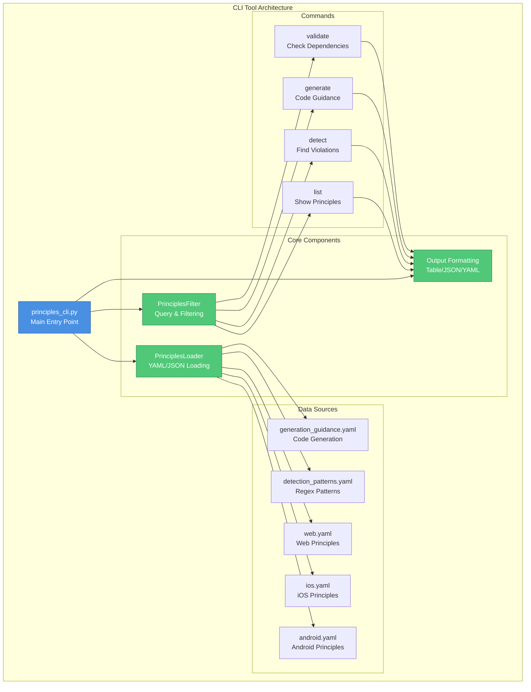
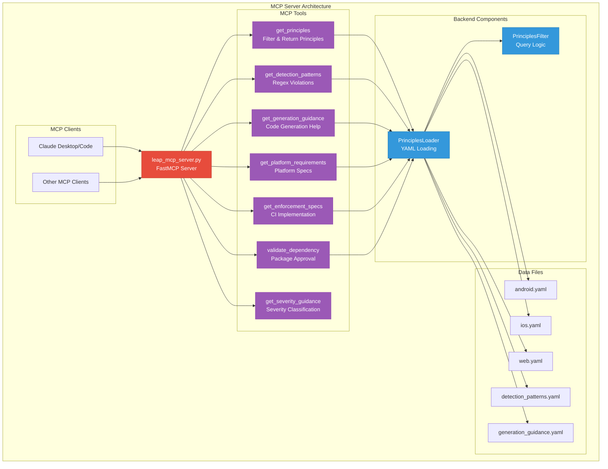

# System Architecture

This document provides architectural diagrams for the engineering principles tooling.

## CLI Tool Architecture

## MCP Server Architecture

## Component Descriptions

### CLI Tool Components

- **PrinciplesLoader**: Loads and parses YAML/JSON principle files
- **PrinciplesFilter**: Provides query and filtering capabilities for principles
- **Output Formatting**: Formats results as tables, JSON, or YAML

### MCP Server Tools

- **get_principles**: Returns filtered engineering principles by platform/focus
- **get_detection_patterns**: Provides regex patterns for detecting violations
- **get_generation_guidance**: Returns guidance for writing compliant code
- **get_platform_requirements**: Returns platform-specific requirements and constraints
- **get_enforcement_specs**: Provides CI implementation guidance
- **validate_dependency**: Checks if a dependency is approved for a platform
- **get_severity_guidance**: Returns severity classification guidance

### Data Sources

All tools share the same YAML-based principle definitions:
- `android.yaml`: Android platform principles
- `ios.yaml`: iOS platform principles
- `web.yaml`: Web platform principles
- `detection_patterns.yaml`: Regex patterns for violation detection
- `generation_guidance.yaml`: Code generation guidance and templates
